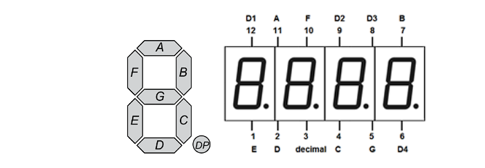

# avr-embedded-stopwatch

A small embedded-systems coursework project written in C for the **ATmega16A** microcontroller.

The project was developed incrementally across several exercises. It demonstrates direct register-level programming, GPIO control, multiplexing of a four-digit seven-segment display, hardware timers, interrupts, button handling, debouncing, and split-time functionality.

## Project Structure

- `01_display_multiplexing.c`  
  Configures GPIO and demonstrates multiplexing of a four-digit seven-segment display.

- `02_stopwatch_timer.c`  
  Adds Timer1 in CTC mode and a periodic compare-match interrupt to implement stopwatch timing.

- `03_stopwatch_controls.c`  
  Adds physical start/stop and reset buttons, internal pull-up resistors, and simple software debouncing.

- `04_external_interrupt_date.c`  
  Adds an external interrupt (`INT0`) that temporarily replaces the stopwatch output with a hard-coded date display.

- `05_split_time.c`  
  Adds a split-time function that captures the current stopwatch value while the stopwatch continues running internally.

## Hardware / Platform

- ATmega16A AVR microcontroller
- Four-digit seven-segment display
- Physical push buttons
- AVR-GCC / AVR C libraries

The microcontroller clock frequency used in the exercises is:

```c
#define F_CPU 7372800UL
```

## Display Layout

The seven-segment display uses the standard segments `A` through `G` plus a decimal-point segment (`DP`).



In the source code:

- **Port A** controls the segment pattern (`A-G` and decimal point).
- **Port B** selects which one of the four digits is currently active.
- The digits are refreshed rapidly using **display multiplexing**, so they appear continuously illuminated to the human eye.

## Timer Operation

Timer1 is configured in **CTC (Clear Timer on Compare Match)** mode.

With:

```c
#define F_CPU 7372800UL
TCCR1B = _BV(WGM12) | _BV(CS11);
OCR1A = 9216;
```

the CPU clock is divided by 8, giving Timer1 a clock of approximately **921.6 kHz**.

A compare match occurs after roughly 9216 timer counts, producing a periodic interrupt approximately every **10 ms**.

The interrupt service routine is then used to update the stopwatch value independently of the display-refresh loop.

## Main Concepts Demonstrated

- AVR register-level programming
- GPIO configuration using `DDR`, `PORT`, and `PIN` registers
- Bit masking and bitwise operations
- Four-digit seven-segment display multiplexing
- Timer1 configuration
- CTC timer mode
- Hardware compare-match interrupts
- External interrupts
- Internal pull-up resistors
- Push-button input handling
- Software debouncing
- Stopwatch start / stop / reset
- Temporary date-display mode
- Split-time capture

## ATmega16A Register Reference

The project uses registers such as:

- `DDRA`, `DDRB`
- `PORTA`, `PORTB`
- `PINB`
- `TCCR1A`, `TCCR1B`
- `OCR1A`
- `TIMSK`
- `MCUCR`
- `GICR`

For register definitions and hardware behavior, see the official **ATmega16A datasheet**:

[ATmega16A Datasheet - Microchip](https://ww1.microchip.com/downloads/en/DeviceDoc/Atmel-8154-8-bit-AVR-ATmega16A_Datasheet.pdf)

> A local Windows path such as `file:///C:/Users/.../ATMega16A-datasheet.pdf` only works on the computer where that file exists, so the public Microchip datasheet link is used here instead.

## Notes

This repository contains university laboratory exercises and is intended as a compact demonstration of embedded C fundamentals rather than a production-ready stopwatch implementation.
